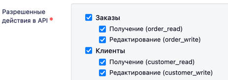
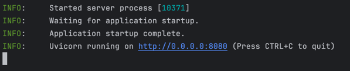
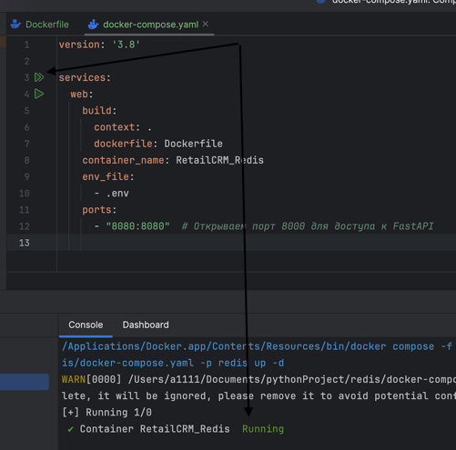

RADIS BY (Тестовое)

Веб приложение по работе сo стороннем API.

Установка

    git clone git@github.com:Na6k/RADIS_BY.git - клонируем проект
    python3.11 -m venv .venv - создаем виртуальное окружение
    pip install poetry  - установка poetry
    poetry install - установка зависимостей (poetry update - обновление)
    Cоздайте .env файл и заполните его как .example_env (p.s. можно просто переимновать в .env)

Заполнение .env файла:

    Как и описано выше для заполнения .env, вы можете скопировать все из .examlpe_env 
    но поле RETAILCRM_API_KEY придется все таки заполнить самостоятельно, для этого перейдите на:
   https://demo.retailcrm.ru/login

    Далее, после того как залогинетесь, следуйте к (Меню Настройки -> Интеграция -> Добавить),
    важно отметить, что при получении API_KEY выберите разрешения:

    
    далее вставьте данный API_KEY в поле RETAILCRM_API_KEY в свой .env файл.

Запуск:

    command: python3 -O -m src
И если вы все сделали верно, увидите:

Важно проверить, что порт :8080 на нашем компьютере свободен (команда для MacOS/Linux):
    
    command: lsof -i :8080
Если он занят - kill PID !!!)))) решит эту проблему)))
Можете переходить по http://0.0.0.0:8080/docs где сможете наблюдать Swagger UI, и работать с описанными методами.

Запуск при помощи Docker:

    Важно сначала создать .env файл - ЭТО ОПИСАНО ВЫШЕ!)
    Теперь достаточно ввести команду для сборки и поднятия команду
    command: docker compose up --build
    или
    command: docker-compose up --build
    Предварительно убедившись, что Docker установлен на ваш ПК.

Теперь также переходи по http://0.0.0.0:8080/docs
Важно понимать, что медлить нельзя, время жизни тестового ключа не большое.

Также если вы используете IDE, контейнер можно запустить при помощи доп. расширений или плагинов как пример PyCharm

